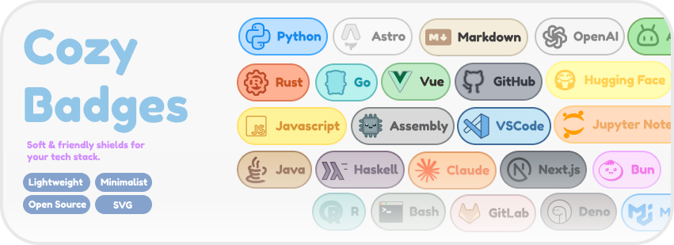
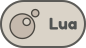

<h1>Cozy Badges for you <sup></sup></h1>

A curated collection of simple, rounded, and beautiful vector (SVG) badges to decorate your GitHub profiles, portfolios, and project READMEs. This is a hobbyist project created to gather and share aesthetic badges for various technologies for free.

Better view and create custom badge: [Figma](https://www.figma.com/community/file/1640980234656264105)

---

## 🚀 How to Use These Badges

You can use these badges directly via **jsDelivr CDN** or **GitHub Raw**. Simply copy the code of your choice from the gallery table below (or download it 😉).

### Method 1: Markdown Link (For GitHub READMEs)

```markdown

```

### Method 2: HTML Code (For size and alignment control)

```html

```

> [!TIP]
> It is highly recommended to use the **jsDelivr CDN** instead of GitHub Raw for production, as it provides global CDN caching and compression for ultra-fast loading.

### Method 3: AI Prompt (Automatic & Simple)

If you are using an AI assistant (like ChatGPT, Claude, Gemini, or Cursor) to maintain your README or portfolio, you can copy-paste the prompt below to let the AI automatically find and apply your badges:

```markdown
Please check the technologies listed in my profile/project and replace my current badges with the ones from the "Cozy Badges" repository. 

Use this CDN template for the badges (using the lowercase technology name, e.g., "react", "tailwindcss", "html5", "vscode"):


If I am using HTML for custom sizing, use this template instead:

```

---

## 📂 Gallery of Available Badges

Below is the list of all available badges. This table is auto-generated alphabetically by a Node.js script based on the SVG files in the repository.

<!-- START_BADGES -->

| Badge | Technology | Usage Links |
| :---: | :---: | :--- |
|  | **Android** | **Markdown:**<br>``<br><br>**HTML:**<br>`` |
|  | **Apple** | **Markdown:**<br>``<br><br>**HTML:**<br>`` |
|  | **Artificial Intelligence** | **Markdown:**<br>``<br><br>**HTML:**<br>`` |
|  | **Assembly** | **Markdown:**<br>``<br><br>**HTML:**<br>`` |
|  | **Astro** | **Markdown:**<br>``<br><br>**HTML:**<br>`` |
|  | **AWS** | **Markdown:**<br>``<br><br>**HTML:**<br>`` |
|  | **Azure** | **Markdown:**<br>``<br><br>**HTML:**<br>`` |
|  | **Bash** | **Markdown:**<br>``<br><br>**HTML:**<br>`` |
|  | **Bootstrap** | **Markdown:**<br>``<br><br>**HTML:**<br>`` |
|  | **Bun** | **Markdown:**<br>``<br><br>**HTML:**<br>`` |
|  | **C#** | **Markdown:**<br>``<br><br>**HTML:**<br>`` |
|  | **C++** | **Markdown:**<br>``<br><br>**HTML:**<br>`` |
|  | **Claude** | **Markdown:**<br>``<br><br>**HTML:**<br>`` |
|  | **Clojure** | **Markdown:**<br>``<br><br>**HTML:**<br>`` |
|  | **CSS3** | **Markdown:**<br>``<br><br>**HTML:**<br>`` |
|  | **Dart** | **Markdown:**<br>``<br><br>**HTML:**<br>`` |
|  | **Deno** | **Markdown:**<br>``<br><br>**HTML:**<br>`` |
|  | **Docker** | **Markdown:**<br>``<br><br>**HTML:**<br>`` |
|  | **Firebase** | **Markdown:**<br>``<br><br>**HTML:**<br>`` |
|  | **Flutter** | **Markdown:**<br>``<br><br>**HTML:**<br>`` |
|  | **GitHub** | **Markdown:**<br>``<br><br>**HTML:**<br>`` |
|  | **GitLab** | **Markdown:**<br>``<br><br>**HTML:**<br>`` |
|  | **Go** | **Markdown:**<br>``<br><br>**HTML:**<br>`` |
|  | **Haskell** | **Markdown:**<br>``<br><br>**HTML:**<br>`` |
|  | **HTML5** | **Markdown:**<br>``<br><br>**HTML:**<br>`` |
|  | **Hugging Face** | **Markdown:**<br>``<br><br>**HTML:**<br>`` |
|  | **Java** | **Markdown:**<br>``<br><br>**HTML:**<br>`` |
|  | **JavaScript** | **Markdown:**<br>``<br><br>**HTML:**<br>`` |
|  | **Jupyter Notebook** | **Markdown:**<br>``<br><br>**HTML:**<br>`` |
|  | **Kotlin** | **Markdown:**<br>``<br><br>**HTML:**<br>`` |
|  | **Kubernetes** | **Markdown:**<br>``<br><br>**HTML:**<br>`` |
|  | **Lua** | **Markdown:**<br>``<br><br>**HTML:**<br>`` |
|  | **Markdown** | **Markdown:**<br>``<br><br>**HTML:**<br>`` |
|  | **MongoDB** | **Markdown:**<br>``<br><br>**HTML:**<br>`` |
|  | **Mui** | **Markdown:**<br>``<br><br>**HTML:**<br>`` |
|  | **NestJS** | **Markdown:**<br>``<br><br>**HTML:**<br>`` |
|  | **Next.js** | **Markdown:**<br>``<br><br>**HTML:**<br>`` |
|  | **Nuxt** | **Markdown:**<br>``<br><br>**HTML:**<br>`` |
|  | **OpenAI** | **Markdown:**<br>``<br><br>**HTML:**<br>`` |
|  | **Php** | **Markdown:**<br>``<br><br>**HTML:**<br>`` |
|  | **PostgreSQL** | **Markdown:**<br>``<br><br>**HTML:**<br>`` |
|  | **Python** | **Markdown:**<br>``<br><br>**HTML:**<br>`` |
|  | **R** | **Markdown:**<br>``<br><br>**HTML:**<br>`` |
|  | **React** | **Markdown:**<br>``<br><br>**HTML:**<br>`` |
|  | **Redis** | **Markdown:**<br>``<br><br>**HTML:**<br>`` |
|  | **Ruby** | **Markdown:**<br>``<br><br>**HTML:**<br>`` |
|  | **Rust** | **Markdown:**<br>``<br><br>**HTML:**<br>`` |
|  | **Sql** | **Markdown:**<br>``<br><br>**HTML:**<br>`` |
|  | **SQLite** | **Markdown:**<br>``<br><br>**HTML:**<br>`` |
|  | **Supabase** | **Markdown:**<br>``<br><br>**HTML:**<br>`` |
|  | **Svelte** | **Markdown:**<br>``<br><br>**HTML:**<br>`` |
|  | **Swift** | **Markdown:**<br>``<br><br>**HTML:**<br>`` |
|  | **TailwindCSS** | **Markdown:**<br>``<br><br>**HTML:**<br>`` |
|  | **Tensorflow** | **Markdown:**<br>``<br><br>**HTML:**<br>`` |
|  | **TypeScript** | **Markdown:**<br>``<br><br>**HTML:**<br>`` |
|  | **Vercel** | **Markdown:**<br>``<br><br>**HTML:**<br>`` |
|  | **VS Code** | **Markdown:**<br>``<br><br>**HTML:**<br>`` |
|  | **Vue.js** | **Markdown:**<br>``<br><br>**HTML:**<br>`` |

<!-- END_BADGES -->

---

## 🤝 Contributions and Local Development

If you'd like to collaborate by adding new technology badges or want to know how to run the local SVG optimization pipeline with Node.js, please check out our **[Contributing Guide (CONTRIBUTING.md)](./CONTRIBUTING.md)**.

There you'll find the design guidelines for Figma and instructions on how to compile the repository locally.

---

## 📄 License

This project is licensed under the **MIT License** for the pipeline code, and the aesthetic badges are licensed under **Creative Commons Attribution 4.0 International (CC BY 4.0)**. This means you can freely use them in personal or commercial projects, as long as you attribute them back to the original repository.
